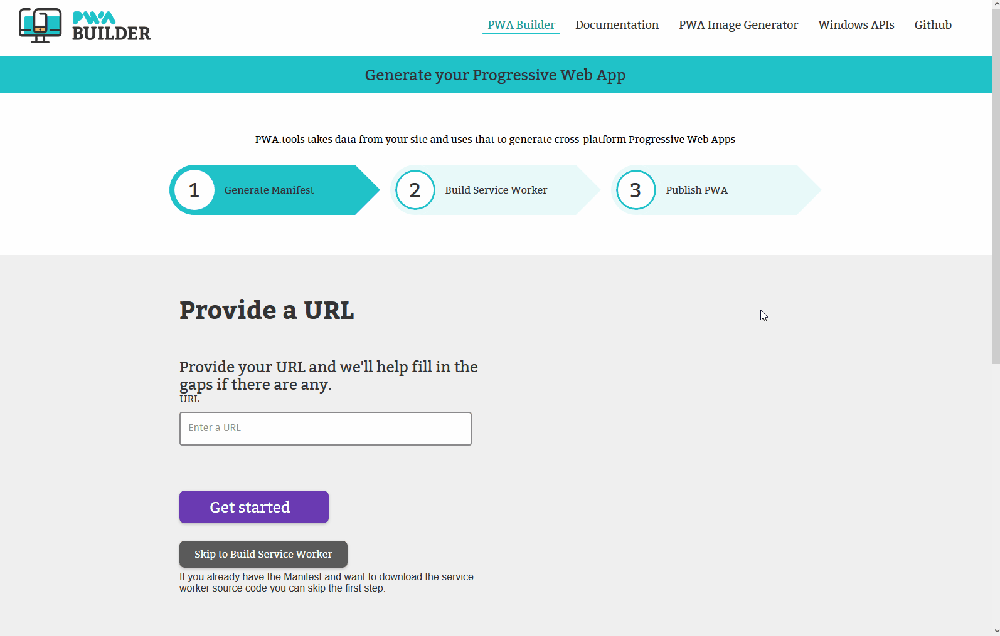

# __PWA-Builder__

Node/Vue/Nuxt site promoting ManifoldJS tool to build manifest files

## Prerequisites

You will need the following things properly installed on your computer.

* [Git](http://git-scm.com/)
* [Node.js](http://nodejs.org/) (with NPM)
* [NPM](http://npmjs.com/)

## Installation

* `git clone <repository-url>` this repository
* change into the new directory
* `npm install`

## Running / Development

* `npm run dev`
* Visit your app at [http://localhost:3000](http://localhost:3000).

### Running Tests

* `npm test`

### Running Test Coverage

* `npm run cover`

### Running Test Coverage

* `npm install selenium-standalone@latest -g` _only once_
* `selenium-standalone install` _only once_
* `npm run e2e`

> You need to have installed [Java JDK](http://www.oracle.com/technetwork/java/javase/downloads/index.html)

### Building

* `npm run build` (production)

### Serve

* `npm start` (doesn't compile the code)

# __Tools__

|  **&nbsp;&nbsp;&nbsp;&nbsp;&nbsp;&nbsp;Tool&nbsp;&nbsp;&nbsp;&nbsp;&nbsp;&nbsp;** | **Description** |
| ----------------- | --------------- |
| <a href="README.md#windowsapi">Windows API</a>       | Features library for your app. |
| <a href="README.md#imagegenerator">Image Generator</a>    | Generates the images that you need for your app. |
| <a href="README.md#serviceworker">Service Worker</a>    | Generates the service workers for your app.   |

## __Windows API (Beta)__

This tool allow us to add differents features to our app. When a feature is selected the site generates the necesary code showing the properties and how use them, also allow us to copy the code or download it.

The steps to follow are:

* Enter to Windows API site from menu tab.
* Search/Select the feature.
* Copy or download the code.

## __PWA Image Generator__

To use this feature you just to select an image then set the padding value and the background color or if you prefer you can choose transparent background, after that select the platforms where your app will run and finally click the download button. This process will generate a .zip file that it will be contains all necessary images for your app.

## __Service Worker Generator__

This feature generates the selected service worker ready to be included in the proyect by copying or downloading it from the site. 
If you need information about Service Worker take a minute to read this page - [Using Service Workers](https://developer.mozilla.org/en-US/docs/Web/API/Service_Worker_API/Using_Service_Workers) -

## Further Reading / Useful Links

* [Vuejs](https://vuejs.org/)
* [Vuex](https://vuex.vuejs.org/en/)
* [Nuxtjs](https://nuxtjs.org/)

